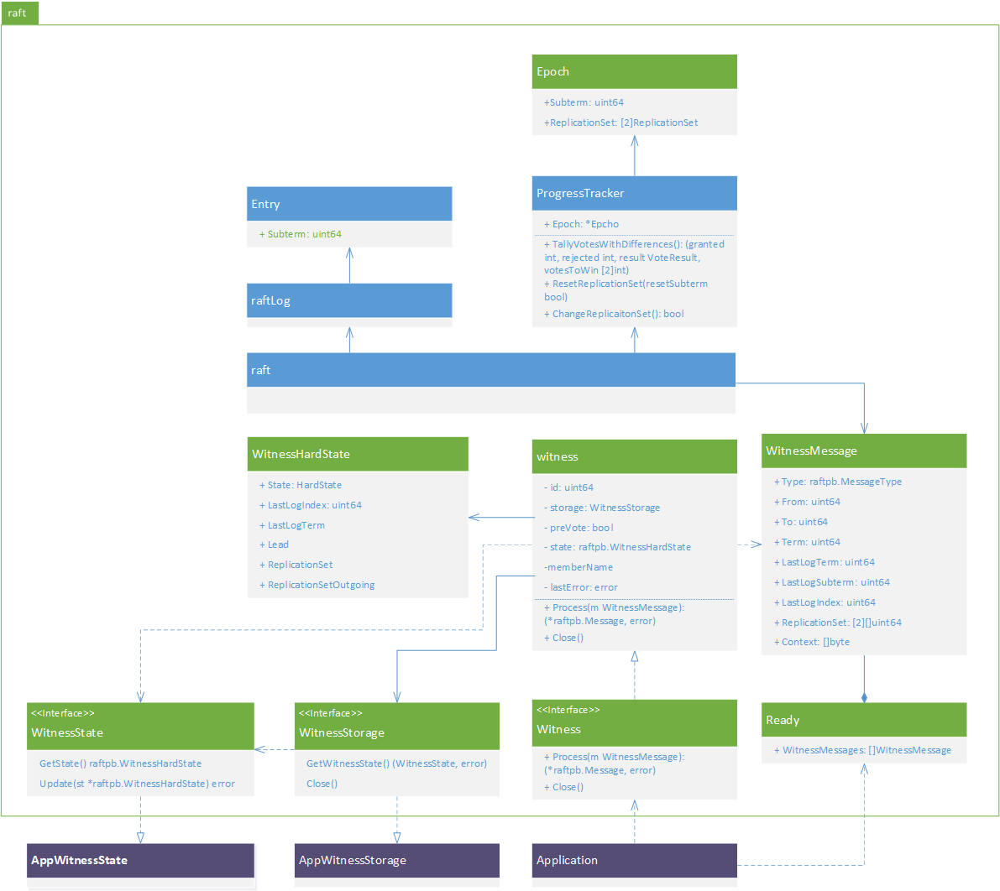

# Motivation


# Goal


# Design

## Overview

## Raft
We amended etcd-io/raft library to implement **extended Raft algorithm**. 



### Witness Message
We use different format for messages sent to witness. The reason is that witness messages are handled locally so there is no need to marshal them to send over wire. 

For this reason, leader maintains an additional message queue `witnessMsgs`, similar to `msgs` message queue in raft. The only difference is that the former is a list of `WitnessMessage` message, instead of `raftpb.Message` in the latter.

### Epoch
Epoch encapsulates subterm and its corresponding repication sets. Each subterm has two replication sets, one for each voter set in a current joint reconfiguration.

Replicaiton set represents a subset of voter set in current configuration. Its size is one less than the voter set if there is a witness. Otherwise it is identical to voter set. Besides the collection of voter IDs in the replication set, we also need to maintain IDs of witness and the voter excluded from the replication set to efficiently facilitate altering the replication set.

`ProgressTracker` maintains its own epoch and capable of changing the replication sets according to its view of peer voters. This is done by `ResetReplicationSet` and `ChangeReplicationSet` member functions of `ProgressTracker`.  

`ResetReplicationSet` re-initialize replication sets in current epoch to their corresponding non-witness voter set. The subterm is either reset to `0` or increments by one, determined by `resetSubterm` argument. Leader's replication set is reset by `ResetReplication` in two cases.
* The leader is elected for the first time. This is when replication set be initialized to non-witness voter set and subterm being changed to 0.
* The leader changes its membership configuration. Both replication sets are reset in this case. But subterm is incremented instead of being reset to 0.

`ChangeReplicationSet` changes current epoch's replications sets according to health status of voters in each configuration. The change is made in a way such that the new replication set contains more healthy voters. That is to say, if the excluded voter is not healthy, switching it with any voter inside replication set will not make the replication set have more healthy voters. If the excluded voter is healthy voter, we can switch it with any non-healthy voter in the replication set to maximize the healthy voters in the replication set. Note that we always take witness as healthy voter. If all voters in the replicaiton set is healthy, we don't change the replication set. There is one exception to this, if all voters are healthy and the replication set contains witness, we reset the replication set to contain only non-witness voters.

There are another two new important member functions in `ProgressTracker`, respectively `OneLessThanQuorumInReplicationSet` and `TallyVotesWithDifference`. The former is used in log replication to decide when leader will send requests to witness. The other one is used in leader election to decide if candidate has received subquorum votes. We will discuss these further in following sections.

### Log Replication
Leader replicates its log entries to non-witness followers in the exact same way as that in the original Raft algorithm. So does the way a log entry is committed - when it receives quorum acknowledgements. The only thing we need to change here is to add a check to decide when a log entry needs to be "replicated" to witness. The quote here means no data will actually be sent to witness. 

The check is implemented in `maybeCommit` function, before calling to `raftLog`'s `maybeCommit` function. The progress tracker's `OneLessThanQuorumInReplicationSet` is called here to get the index of the latest entry who has received subquorum acknowledgements. If current configuration does not have a witness, the index will be 0. Having such non-zero index returned, and the log entry has same `term` and `subterm` as current epoch, leader will try to "replication" log entries up to this index to witness (via `sendAppendToWitness`). Note that we add special `sendXXXToWitness` functions for its peer `sendXXX` functions. The reason is that we don't need to marshal witness messages. 

Witness will handle this message and response regular `MsgAppResp` response like any other followers. So, leader can decide if a log entry can be committed in exact same way as before.

### Leader Election
The change in leader election is straightforward. Candidates requests votes from non-witness voters as before. It only needs to check the granted votes and requests votes from witness when it has received subquorum votes. This is done by adding additional `votesToWin` in the return values of `poll`. `votesToWin` contains the counts of additional votes before current candidate wins the campaign. 

Candidates check its vote differences everytime if polls the current voting status. Whenever it realizes it only needs one additional vote to win the campaign. The vote request was sent via `sendRequestVoteToWitness` function, with `term`, `subterm`, and voted follower IDs in the message.

### Witness Message Processing

### Witness Abstraction


### Membership Reconfiguration


### Linearizable Read

## etcd

### Witenss Peer

### Witness Implementation

### Bootstrap Witness

### Runtime Reconfiguration

# Operation Guide
Witness can be treated as a special member with special format of advertise peer URL. That is all that an etcd instance needs to be aware of. etcd uses exactly same protocols to communicate with each other, which means there is no change in the way they are operated. All existing scripts and tools for etcd operations shall work as expected as long as they only manages etcd instances. Additional operations are needed to manage witness, while the concept and experience are similar to those for etcd instances.

## Witness Options
In current implementation, we support two kinds of witnesses: mounted share storage, and Azure Blob. 

### Mounted Share Storage Witness
A mounted share storage is a shared storage that mounts to all machines or containers where etcd instances run. A typical mounted share storage is an NFS or SMB shared folder. The exported file system must fulfill following requirements:
* File system supports hard link. 
* File system supports fsync.

Advertise peer URL of a mounted share storage is `witness:mount?path=<escaped mount point>`. For example, if we use an NFS share as witness and mount it to `/var/witness` in each machine where etcd instance runs, the witness's advertise peer URL will be `witness:mount?path=%2Fvar%2Fwitness`. Note that, unlike etcd instance, witness can have only one advertise peer URL.

The storage capacity requirement is trivial. Depending on witness state history retention policy, a mounted share storage just needs a few KB storage capacity. 

etcd access mounted share share storage witness via the local mount point. It is operator's responsibility to ensure the storage is mounted correctly.

### Cloud Witness
Cloud witness is a witness that uses cloud storage as storage. For now we only support Azure Blob. 

Advertise peer URL of Azure Blob witness is `witness:azblob?uri=<escaped sas uri>`. Similarly, cloud witness also only have one advertise peer URI. The blob object's SAS URI shall be configured with read and write access permssions. And the blob shall be accessible from all etcd instances, meaning that etcd instances and the environment they run shall have external internet connections.


## Create etcd Cluster With Witness

etcd has 3 ways to bootstrap a cluster: Static, etcd Discovery, and DNS Discovery. If the cluster contains a witness, static or etcd discovery method can be used, with just a small modification for bootstrapping witness. DNS discovery currently does not support creating cluster with witness. But it is always OK to create a cluster without witness using any of the 3 bootstrap methods, followed by a runtime reconfiguration to add witness.

### Static
Bootstraping an etcd cluster without witness consists of starting etcd instances in each machine with `initial-cluster` set to the advertised peer URLs of all members. For example, bootstrapping etcd cluster with 3 members can be done by starting etcd with these flags:

```
$ etcd --name infra0 --initial-advertise-peer-urls http://10.0.1.10:2380 \
  --listen-peer-urls http://10.0.1.10:2380 \
  --listen-client-urls http://10.0.1.10:2379,http://127.0.0.1:2379 \
  --advertise-client-urls http://10.0.1.10:2379 \
  --initial-cluster-token etcd-cluster-1 \
  --initial-cluster infra0=http://10.0.1.10:2380,infra1=http://10.0.1.11:2380,infra2=http://10.0.1.12:2380 \
  --initial-cluster-state new
```
```
$ etcd --name infra1 --initial-advertise-peer-urls http://10.0.1.11:2380 \
  --listen-peer-urls http://10.0.1.11:2380 \
  --listen-client-urls http://10.0.1.11:2379,http://127.0.0.1:2379 \
  --advertise-client-urls http://10.0.1.11:2379 \
  --initial-cluster-token etcd-cluster-1 \
  --initial-cluster infra0=http://10.0.1.10:2380,infra1=http://10.0.1.11:2380,infra2=http://10.0.1.12:2380 \
  --initial-cluster-state new
```
```
$ etcd --name infra2 --initial-advertise-peer-urls http://10.0.1.12:2380 \
  --listen-peer-urls http://10.0.1.12:2380 \
  --listen-client-urls http://10.0.1.12:2379,http://127.0.0.1:2379 \
  --advertise-client-urls http://10.0.1.12:2379 \
  --initial-cluster-token etcd-cluster-1 \
  --initial-cluster infra0=http://10.0.1.10:2380,infra1=http://10.0.1.11:2380,infra2=http://10.0.1.12:2380 \
  --initial-cluster-state new
```

`initial-clluster` is set to `infra0=http://10.0.1.10:2380,infra1=http://10.0.1.11:2380,infra2=http://10.0.1.12:2380` for each etcd instance.

To bootstrap a similar cluster with a witness. Let's say the advertise peer URL of the mounted share storage witness is `witness:mount?path=%2Fvar%2Fwitness`, operations would become running two etcd instances and an additional witness bootstrap.
```
$ etcd --name infra0 --initial-advertise-peer-urls http://10.0.1.10:2380 \
  --listen-peer-urls http://10.0.1.10:2380 \
  --listen-client-urls http://10.0.1.10:2379,http://127.0.0.1:2379 \
  --advertise-client-urls http://10.0.1.10:2379 \
  --initial-cluster-token etcd-cluster-1 \
  --initial-cluster infra0=http://10.0.1.10:2380,infra1=http://10.0.1.11:2380,infra2=witness:mount?path=%2Fvar%2Fwitness \
  --initial-cluster-state new
```
```
$ etcd --name infra1 --initial-advertise-peer-urls http://10.0.1.11:2380 \
  --listen-peer-urls http://10.0.1.11:2380 \
  --listen-client-urls http://10.0.1.11:2379,http://127.0.0.1:2379 \
  --advertise-client-urls http://10.0.1.11:2379 \
  --initial-cluster-token etcd-cluster-1 \
  --initial-cluster infra0=http://10.0.1.10:2380,infra1=http://10.0.1.11:2380,infra2=witness:mount?path=%2Fvar%2Fwitness \
  --initial-cluster-state new
```
```
$ etcdutl witness init --name infra2 \
  --advertise-peer-url witness:mount?path=%2Fvar%2Fwitness
```

This set up a similar cluster with `infra2` member replaced by a witness. Note that the only difference in bootstrapping infra0 and infra1 etcd instances are their `initial-cluster` argument where witness's advertise peer URL is used. And `etcdutl` is used to bootstrap witness instead of running the third etcd instance.

### etcd Discovery


## Member Information

## Add/Remove/Update Witness

## Disaster Recovery

# Test

## Existing Tests

## Addtional Tests

### E2E and Integration

### Robustness

### TLA+ Trace Validation

### Metrics

# Progress and Plan
