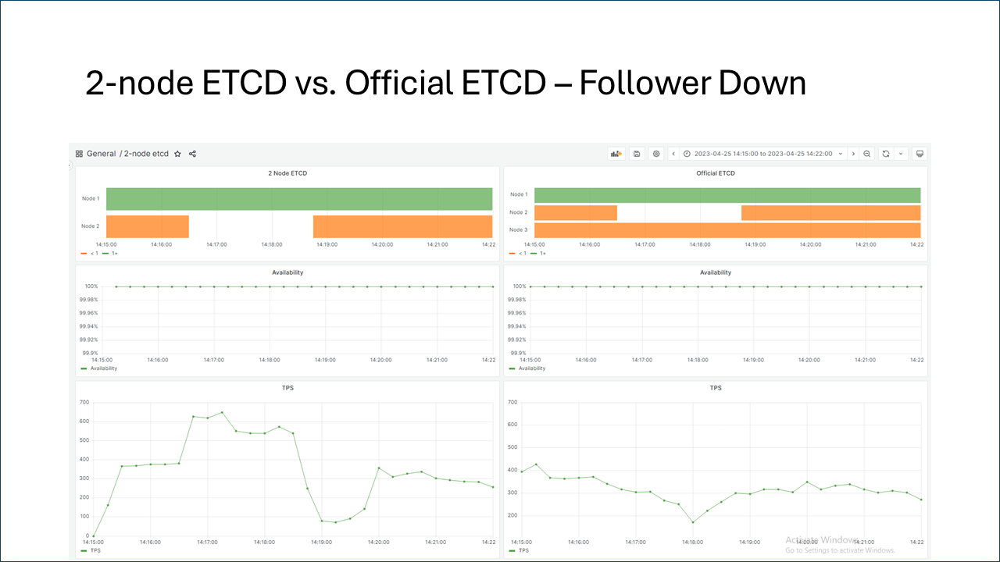
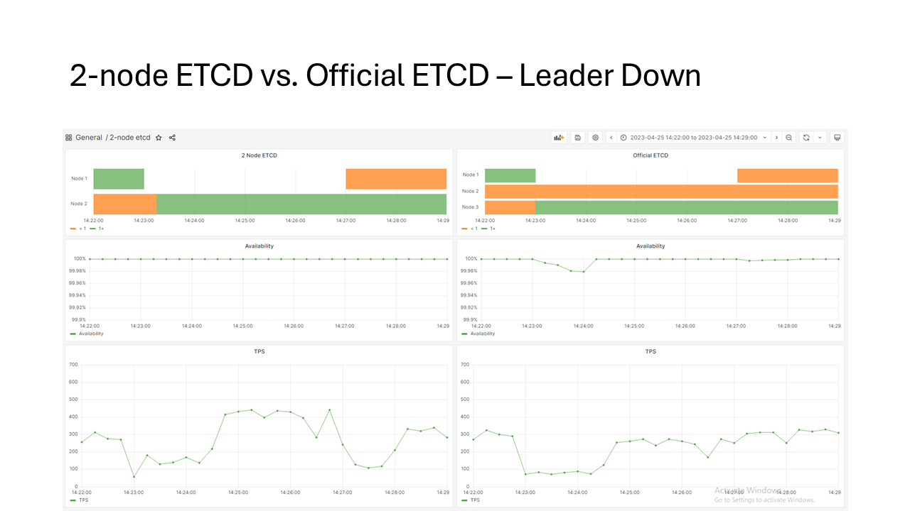
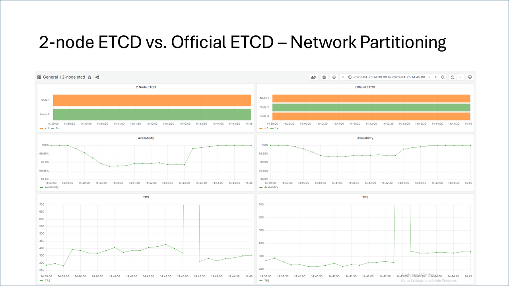

# Motivation
Kubernetes is a widely used platform for running and managing applications in containers. However, to have a highly available Kubernetes cluster, the deployments require a minimum of three nodes, which are challenging in many environments with space constraints and cost considerations. This is especially true in edge computing scenarios in some customer segments like retail, where the customer will deploy thousands of sites across their operations. In such environments, there is a growing demand for highly available Kubernetes clusters for efficiency and cost-effectiveness. 
The reason of existing K8s and k3s to require 3+ control plane nodes for its high-availability is mainly because of its key dependency - etcd which is a strongly consistent, distributed key-value store based on Raft protocol. 

In distributed systems, Raft requires odd number of servers to always maintain a quorum that remains functional and communicative in case of network partition faults. Practically, this means a Raft cluster size should be at least three to tolerate a single point of failure.

While the requirement for an odd cluster size isn't problematic for large-scale distributed systems, it can pose a challenge for budget-constrained customers who need to reach consensus with fewer servers. One solution to this issue is to substitute one server in the cluster with a cost-effective entity known as a witness. The witness acts as a tie-breaker, ensuring the maintenance of a quorum in case of an even split of servers due to network issues. Witness typically operates on low-configuration hardware to save costs, seldom participates in critical data paths, and only persists a minimal amount of data. In the Paxos algorithm, a witness can be implemented as shared storage, which is not only inexpensive but also widely available to most customers.

Enabling witness support in etcd would allow Kubernetes clusters to operate with fewer machines while maintaining comparable availability to current configurations. This is a significant benefit for budget-conscious users. Witnesses act as tie-breakers in case of network issues, ensuring a functional quorum can still be formed even with an even number of servers.

# Goal
Etcd leverages a modular design by relying on the separate shared library `etcd-io/raft` for its core Raft consensus algorithm. This modularity allows other applications to reuse the robust Raft library. While etcd itself is widely used (e.g., Kubernetes), this design offers more than just witness support for etcd clusters.

1. This new design enables etcd to create highly available clusters by incorporating a witness in place of a traditional member node. Traditionally, a 3-node etcd cluster could be reduced to just 2 active nodes with a shared storage like NFS or Azure Blob acting as the witness.

1. Backward compatibility with existing etcd deployments (vanilla etcd) is a critical aspect. This includes compatibility on both the API level and backend data level. Maintaining compatibility ensures that existing applications reliant on etcd continue to function seamlessly. Additionally, backend data compatibility preserves management and operation experience like recovering from old snapshots.

1. The `etcd-io/raft` library is extended to support witness functionality through a compatible variant of the Raft algorithm, as detailed in the extended Raft algorithm paper ([extended Raft algorithm](https://github.com/joshuazh-x/extended-raft-paper/blob/main/main.pdf)). This ensures that the extended Raft algorithm remains fully compatible with the vanilla version. By maintaining API and behavior compatibility throughout the implementation, applications built on raft library can continue to function as expected.

It is also important to seamless upgrade of existing clusters to a witness-enabled version and, if necessary, downgrade to a previous vanilla version for users with specific concerns.

# Design

## Overview

Witness is introduced as a special type of member within the cluster. This design allows them to integrate seamlessly into existing etcd and Raft workflows without disrupting established functionalities.

The core extension of the Raft algorithm resides within the `etcd-io/raft` library. This strategic placement ensures the benefits of witness functionality can be leveraged by all applications that depend on this library. The changes within the Raft library primarily target the algorithm flow itself, introducing an abstracted witness storage interface. The actual implementation of this interface is left to the applications that utilize the library. This approach maximizes the flexibility of the Raft library, allowing applications to choose the witness storage solution that best suits their specific needs.

etcd itself serves as a prime example of an application that leverages the witness functionality. It provides its own implementation for witness storage, along with functionalities specifically designed for witness management.

||
|:--:|
| *Component diagram of etcd with witness* |


||
|:--:|
| *Data flow in etcd with witness* |


## Raft
We amended etcd-io/raft library to implement **extended Raft algorithm**. 

||
|:--:|
| *Class diagram of the extend etcd-io/raft library* | 

### Witness Message
In our system, witness messages are treated differently from other messages sent within the network. The rationale behind this distinction lies in the fact that witness messages are processed locally, eliminating the need for marshaling and transmission over the wire.

To facilitate this behavior, the leader maintains an additional message queue called `witnessMsgs`. This queue is similar to the existing `msgs` message queue used in the Raft consensus protocol. However, the `msgs` queue contains instances of `raftpb.Message`, while the `witnessMsgs` queue exclusively holds `WitnessMessage` objects.

By this manner, we optimize the handling process and ensure efficient local processing without unnecessary serialization and network overhead.


### Epoch
Epoch encapsulates subterm along with its corresponding replication sets. Each subterm has two replication sets — one for each voter set in the current joint reconfiguration.

The replication set represents a subset of the voter set in the current configuration. Its size is one less than the voter set if there is a witness. Otherwise, it is identical to the voter set. Along with the collection of voter IDs in the replication set, we also maintain the IDs of the witness and the voter excluded from the replication set. This arrangement allows efficient alterations to the replication set.

The `ProgressTracker` maintains its own epoch and is capable of changing the replication sets based on its view of peer voters. This functionality is achieved through two member functions:

1. `ResetReplicationSet`: This function re-initializes the replication sets in the current epoch to their corresponding non-witness voter set. The subterm is either reset to 0 or incremented by one, depending on the `resetSubterm` argument.
1. `ChangeReplicationSet`: This function allows dynamic adjustments to the replication sets based on changes in the view of peer voters.

The leader’s replication set undergoes specific handling:

* When the leader is elected for the first time, the replication set is initialized to the non-witness voter set, and the subterm is set to 0.
* If the leader modifies the membership configuration, both replication sets are reset. However, instead of resetting to 0, the subterm is incremented.

---
The `ChangeReplicationSet` function dynamically modifies the replication sets within the current epoch based on the health status of voters in each configuration. The goal is to create a new replication set that includes more healthy voters. Here are the key principles governing this process:

1. Excluded Voter Health: If the excluded voter is not healthy, swapping it with any voter already inside the replication set will not increase the number of healthy voters in the set.
1. Maximizing Healthy Voters: When the excluded voter is a healthy voter, we can replace it with any non-healthy voter from the replication set to maximize the count of healthy voters within the replication set. Notably, witnesses are always considered healthy.
1. All Healthy Voters: If all voters in the replication set are healthy, no changes are made to the set.
1. Witness Exception: An exception occurs when all voters are healthy, and the replication set contains a witness. In this scenario, we reset the replication set to include only non-witness voters.

Two new essential member functions have been introduced in the `ProgressTracker`:

1. `OneLessThanQuorumInReplicationSet`: This function plays an important role in log replication. It determines when the leader should send requests to the witness.
1. `TallyVotesWithDifference`: Used during leader election, this function assesses whether a candidate has received subquorum votes.

### Log Replication
Leader replicates log entries to non-witness followers using the same mechanism as the vanilla Raft algorithm. Similarly, the process of committing a log entry — triggered upon receiving quorum acknowledgments — remains consistent. However, we introduce a  modification: determining when a log entry should be "replicated" to the witness. Note that this replication does not involve transmitting actual data to the witness.

The check for witness replication occurs within the `maybeCommit` function, just before invoking the `maybeCommit` function of the raftLog. Here’s how it works:

1. The `ProgressTracker’s` `OneLessThanQuorumInReplicationSet` function is called. This function returns the index of the latest entry that has received subquorum acknowledgments. If the current configuration does not have a witness, the index will be 0.
1. If a non-zero index is returned and the log entry has the same term and subterm as the current epoch, the leader attempts to replicate log entries up to this index with the witness. This is achieved via the `sendAppendToWitness` function. Notably, we've introduced specialized `sendXXXToWitness` functions for peers, as there’s no need to marshal witness messages.
1. The witness processes this message and responds with a regular `MsgAppResp`, similar to how it handles other followers. Consequently, the leader can determine whether a log entry can be committed in the same manner as before.

```go
func (r *raft) maybeCommit() bool {
  r.trk.Committed()
  // check if we can commit on subquorum acks in current replication set
  idxMap := r.trk.OneLessThanQuorumInReplicationSet()
  for w, wci := range idxMap {
    if wci > 0 {
      e := r.raftLog.entry(uint64(wci))
      if e.Term == r.Term && e.Subterm == r.trk.Epoch.Subterm {
        // send MsgApp witness message with entry received subquorum acks
        r.sendAppendToWitness(w, uint64(wci))
      }
    }
  }

  return r.raftLog.maybeCommit(entryID{term: r.Term, index: r.trk.Committed()})
}
```

### Leader Election
The adjustments to leader election are straightforward. Candidates continue to request votes from non-witness voters, following the established process. However, we introduce a new step: when a candidate has received subquorum votes, it requests votes from the witness.

We enhance the poll function by including an additional parameter called `votesToWin`. This parameter represents the count of additional votes needed for the current candidate to secure victory in the campaign.

Candidates continuously monitor their vote differences as they poll the current voting status. When a candidate realizes that it requires only one additional vote to win the campaign, it sends a vote request to the witness. This request is made using the sendRequestVoteToWitness function, including the term, subterm, and the IDs of the followers who have already voted.

```go
func stepCandidate(r *raft, m pb.Message) error {
  ...
  
	case myVoteRespType:

  ...

    // get remaining votes to win campaign
    gr, rj, res, rv := r.pollAndReportDiff(m.From, m.Type, !m.Reject)  
  
  ...

    case quorum.VotePending:
      witnessReadyToVote := r.getWitnessVoteRequestReadiness(rv)
      for witnessID, ready := range witnessReadyToVote {
        if ready {
          var myVoteType pb.MessageType
          var term uint64
          if r.state == StatePreCandidate {
            myVoteType = pb.MsgPreVote
            term = r.Term + 1
          } else {
            myVoteType = pb.MsgVote
            term = r.Term
          }
          // candidate requests vote from witness
          r.sendRequestVoteToWitness(nil, witnessID, myVoteType, term)
        }
      }

  ...

}
```

### Witness Message Processing
The `witness` class encapsulates the logic for handling witness messages in the extended Raft algorithm. This class utilizes simplified follower-only operations from Raft's `step` functions within its `Process` function to handle incoming witness messages. Upon successful processing, it generates a standard Raft response message, mimicking a real node.

The extended Raft algorithm presents "shortcut commit." This allows committing entries in current subterm based on acknowledgments from a subquorum of followers, provided the current subterm is already written to the witness. To minimize leader changes, the witness class, rather than the leader itself, handles shortcut commits. The witness class caches the latest successfully replicated subterm written to the witness. If an incoming MsgApp witness message matches this cached subterm, the witness class directly returns an acknowledgment.

Multiple `witness` instances from different etcd nodes may potentially update the witness state in shared storage simultaneously. However, conflicts are rare because leader and candidate nodes only access the witness during fault events or campaigning.  To address this low-contention scenario, the witness class employs an optimistic concurrency scheme to write versioned states to persistent storage (via an abstract storage interface, which will be discussed later). This eliminates the need for locking mechanisms, improving performance and avoiding potential issues associated with using locks in network file systems like NFS or SMB shares.

### Witness Storage Abstraction
Any shared storage can act as a witness as long as it can fit into the optimistic concurency scheme. To perserve the flexibility, we abstract witness state I/O into interfaces (`WitnessState` and `WitnessStorage`) so that we an always implmenet new witness by implementing these interfaces.

`WitnessStorage` is a state factory for a specific storage media. And `WitnessState` encapsulates a specific version of witness state data and is responsible for updating current state to a new state, giving no change was made in the middle. For each witness message being processed in `witness`, a new `WitnessState` object is loaded. Acompaning with the message, new states are calculated and tried to update to storage via the `WitnessState` object. 

### Membership Reconfiguration

The `witness` class can utilize any shared storage that supports optimistic concurrency scheme. To maintain flexibility, we abstract witness state I/O into two interfaces: `WitnessState` and `WitnessStorage`. This allows for easy implementation of new witness backends by simply creating classes that adhere to these interfaces.

`WitnessStorage` acts as a factory, responsible for creating `WitnessState` objects with latest states loaded from underlying persisted storage.
`WitnessState` encapsulates a specific version of the witness state data. It provides methods for updating the current state to a new one, which will succeed if no concurrent modifications have occurred.
During witness message processing, a new `WitnessState` object is loaded. New witness state information is then calculated and attempted to be written to storage using the loaded WitnessState object.

### Linearizable Read

## etcd

### Witenss Peer

### Witness Implementation

### Bootstrap Witness

### Runtime Reconfiguration

# Operation Guide
Witnesses are introduced as special members with a unique format in their advertised peer URLs. This distinction is the only element etcd instances need to recognize. Importantly, etcd maintains the same communication protocols used for regular member interactions. As a result, existing operational procedures for etcd itself remain undisrupted.

All existing scripts and tools designed for etcd management will continue to function seamlessly, as long as they focus solely on managing etcd instances and not the witness itself. These tools remain perfectly suitable for your regular etcd maintenance tasks.

While the overall experience of managing witnesses shares similarities with managing etcd instances, there are additional operations specific to witness management. These operations are essential for ensuring the witness fulfills its role effectively within the cluster.

## Witness Options
etcd currently supports two types of witnesses for enhanced cluster availability: mounted share storage and Azure Blob storage.

### Mounted Share Storage Witness
A mounted share storage witness leverages a shared storage resource accessible across all machines or containers running etcd instances. Common examples include NFS (Network File System) or SMB (Server Message Block) shared folders. The exported filesystem must support:

* Hard Links
* fsync

The advertise peer URL format for a mounted share storage witness is:
```
witness:mount?path=<escaped mount point>
```
For instance, if you use an NFS share mounted to `/var/witness` on each machine, the witness URL would be:
```
witness:mount?path=%2Fvar%2Fwitness
```
Unlike etcd instances, a witness can only have one advertise peer URL.

Storage capacity requirements for mounted share storage witnesses are minimal, typically just a few kilobytes, depending on witness state history retention.

etcd instances access the mounted share storage witness through the local mount point. However, the operator is responsible for ensuring the storage is correctly mounted and accessible.

### Cloud Witness
An Azure Blob witness utilizes Azure Blob storage as its backend.

The advertise peer URL format for an Azure Blob witness is:
```
witness:azblob?uri=<escaped SAS URI>
```
Specifically, `<escaped SAS URI>` represents the Shared Access Signature (SAS) URI for the Azure Blob configured with both read and write access permissions.

For proper functioning, the Azure Blob must be accessible from all etcd instances. This necessitates external internet connectivity for both the etcd instances and their execution environment.


## Create etcd Cluster With Witness

etcd provides three methods for bootstrapping a cluster: Static configuration, etcd discovery, and DNS discovery. When using a witness for enhanced availability, either static configuration or etcd discovery can be employed with a minor adjustment for witness initialization. However, DNS discovery is not currently compatible with witness-involved cluster creation.

The beauty of etcd's design is that you can establish a cluster without a witness using any of the three bootstrap methods. Subsequently, you can seamlessly introduce a witness at runtime through a reconfiguration process.

### Static
To establish an etcd cluster without a witness, it's necessary to start etcd instances on each machine, configuring the `initial-cluster` to reflect the advertised peer URLs of every member. If, for instance, you're setting up an etcd cluster with three members, this can be accomplished by initiating etcd with the following parameters:

```
$ etcd --name infra0 --initial-advertise-peer-urls http://10.0.1.10:2380 \
  --listen-peer-urls http://10.0.1.10:2380 \
  --listen-client-urls http://10.0.1.10:2379,http://127.0.0.1:2379 \
  --advertise-client-urls http://10.0.1.10:2379 \
  --initial-cluster-token etcd-cluster-1 \
  --initial-cluster infra0=http://10.0.1.10:2380,infra1=http://10.0.1.11:2380,infra2=http://10.0.1.12:2380 \
  --initial-cluster-state new
```
```
$ etcd --name infra1 --initial-advertise-peer-urls http://10.0.1.11:2380 \
  --listen-peer-urls http://10.0.1.11:2380 \
  --listen-client-urls http://10.0.1.11:2379,http://127.0.0.1:2379 \
  --advertise-client-urls http://10.0.1.11:2379 \
  --initial-cluster-token etcd-cluster-1 \
  --initial-cluster infra0=http://10.0.1.10:2380,infra1=http://10.0.1.11:2380,infra2=http://10.0.1.12:2380 \
  --initial-cluster-state new
```
```
$ etcd --name infra2 --initial-advertise-peer-urls http://10.0.1.12:2380 \
  --listen-peer-urls http://10.0.1.12:2380 \
  --listen-client-urls http://10.0.1.12:2379,http://127.0.0.1:2379 \
  --advertise-client-urls http://10.0.1.12:2379 \
  --initial-cluster-token etcd-cluster-1 \
  --initial-cluster infra0=http://10.0.1.10:2380,infra1=http://10.0.1.11:2380,infra2=http://10.0.1.12:2380 \
  --initial-cluster-state new
```

`initial-clluster` is set to `infra0=http://10.0.1.10:2380,infra1=http://10.0.1.11:2380,infra2=http://10.0.1.12:2380` for each etcd instance.

To bootstrap a similar cluster with a witness. Let's say the advertise peer URL of the mounted share storage witness is `witness:mount?path=%2Fvar%2Fwitness`, operations would become running two etcd instances and an additional witness bootstrap.
```
$ etcd --name infra0 --initial-advertise-peer-urls http://10.0.1.10:2380 \
  --listen-peer-urls http://10.0.1.10:2380 \
  --listen-client-urls http://10.0.1.10:2379,http://127.0.0.1:2379 \
  --advertise-client-urls http://10.0.1.10:2379 \
  --initial-cluster-token etcd-cluster-1 \
  --initial-cluster infra0=http://10.0.1.10:2380,infra1=http://10.0.1.11:2380,infra2=witness:mount?path=%2Fvar%2Fwitness \
  --initial-cluster-state new
```
```
$ etcd --name infra1 --initial-advertise-peer-urls http://10.0.1.11:2380 \
  --listen-peer-urls http://10.0.1.11:2380 \
  --listen-client-urls http://10.0.1.11:2379,http://127.0.0.1:2379 \
  --advertise-client-urls http://10.0.1.11:2379 \
  --initial-cluster-token etcd-cluster-1 \
  --initial-cluster infra0=http://10.0.1.10:2380,infra1=http://10.0.1.11:2380,infra2=witness:mount?path=%2Fvar%2Fwitness \
  --initial-cluster-state new
```
```
$ etcdutl witness init --name infra2 \
  --advertise-peer-url witness:mount?path=%2Fvar%2Fwitness
```

This configuration establishes a similar cluster where the `infra2` member is substituted by a witness. It's important to note that the only distinction in bootstrapping the `infra0` and `infra1` etcd instances lies in their `initial-cluster` argument, which employs the witness's advertised peer URL. Additionally, `etcdutl` is utilized to bootstrap the witness, rather than running a third etcd instance.

### etcd Discovery
When the peer IPs of a cluster are unknown during the bootstrapping process, a discovery service can aid in the cluster's formation. An etcd bootstrapped with a discovery service will register its advertised peer URI to a central provider and acquire other peers' IPs from the same source. This discovery protocol is also applicable to witness discovery.

The initial step in etcd discovery involves creating a unique key-value entry within an existing cluster, which designates the cluster size and a unique token.
```
$ curl -X PUT https://myetcd.local/v2/keys/_etcd/registry/6c007a14875d53d9bf0ef5a6fc0257c817f0fb83/_config/size -d value=3
```

Each member bootstraps itself with `discovery` setting to the discovery endpoint (`https://myetcd.local/v2/keys/discovery/6c007a14875d53d9bf0ef5a6fc0257c817f0fb83`). 
```
$ etcd --name infra0 --initial-advertise-peer-urls http://10.0.1.10:2380 \
  --listen-peer-urls http://10.0.1.10:2380 \
  --listen-client-urls http://10.0.1.10:2379,http://127.0.0.1:2379 \
  --advertise-client-urls http://10.0.1.10:2379 \
  --discovery https://myetcd.local/v2/keys/_etcd/registry/6c007a14875d53d9bf0ef5a6fc0257c817f0fb83
```
```
$ etcd --name infra1 --initial-advertise-peer-urls http://10.0.1.11:2380 \
  --listen-peer-urls http://10.0.1.11:2380 \
  --listen-client-urls http://10.0.1.11:2379,http://127.0.0.1:2379 \
  --advertise-client-urls http://10.0.1.11:2379 \
  --discovery https://myetcd.local/v2/keys/_etcd/registry/6c007a14875d53d9bf0ef5a6fc0257c817f0fb83
```

In the case of a cluster without a witness, a similar command will be executed for the etcd member `infra2`. However, for a cluster with a witness, it is simply necessary to manually generate a key-value entry within the discovery service, using the witness's advertised peer URI. This action should adhere to the protocol specifications outlined in the [Discovery service protocol](https://etcd.io/docs/v3.5/dev-internal/discovery_protocol/).
```
$ curl -X PUT https://myetcd.local/v2/keys/_etcd/registry/6c007a14875d53d9bf0ef5a6fc0257c817f0fb83/0000000000000000?prevExist=false -d value="infra2=witness:mount?path=%2Fvar%2Fwitness"
```

## Member Information
etcd exposes member information, including a new `isWitness` field, through its gRPC API at `/v3/cluster/member/list`. This field indicates whether a member is a witness in the cluster. Additionally, the `etcdctl` tool has been updated to display the `isWitness` field, allowing users to easily identify witness members.

```
message Member {
  option (versionpb.etcd_version_msg) = "3.0";

  // ID is the member ID for this member.
  uint64 ID = 1;
  // name is the human-readable name of the member. If the member is not started, the name will be an empty string.
  string name = 2;
  // peerURLs is the list of URLs the member exposes to the cluster for communication.
  repeated string peerURLs = 3;
  // clientURLs is the list of URLs the member exposes to clients for communication. If the member is not started, clientURLs will be empty.
  repeated string clientURLs = 4;
  // isLearner indicates if the member is raft learner.
  bool isLearner = 5 [(versionpb.etcd_version_field)="3.4"];
  // isWitness indicates if the member is raft witness.
  bool isWitness = 6;
}
```

## Add/Remove/Update Witness
Witness management remains straightforward and integrates seamlessly with existing member management. No changes are required to the member management API interfaces. Witnesses can be added, removed, or updated just like regular members. Internally, etcd determines whether a member is a witness based on its advertised URL. Witness URLs have a unique scheme, witness, to differentiate them from regular members.

For instance, to add a witness to a cluster without one, simply follow the same procedure used for adding a regular member.
```
$ etcdctl member add infra3 --peer-urls "witness:mount?path=%2Fvar%2Fwitness"
```
Following the addition of the witness, it needs to be initialized (bootstrapped) to begin serving the cluster.
```
$ etcdutl witness init --name infra3 --initial-advertise-url witness:mount?path=%2Fvar%2Fwitness
```
The process for removing or updating a witness is identical to that of a regular member. To illustrate, consider a witness member with ID `a8266ecf031671f3`:
```
$ etcdctl member remove a8266ecf031671f3
```
```
$ etcdctl member update a8266ecf031671f3 --peer-urls "witness:mount?path=%2Fvar%2Fwitness2"
```

## Disaster Recovery
While etcd leverages periodic snapshots for disaster recovery, these snapshots do not include witness data. Therefore, during a disaster recovery scenario involving a witness, replacing the old witness with a new one is recommended. Here's the recommended recovery process:

1. Clean Up Witness: Remove witness data or disconnect it from the cluster.
2. Restore Members: Restore all cluster members from their respective snapshots.
3. Remove Old Witness: Remove the old witness from the cluster.
4. Add New Witness: Add a new witness to the cluster.

# Test

## Existing Tests
To ensure seamless integration of witness functionality within etcd, we've undertaken a rigorous testing process. Existing etcd test suite has been modified to accommodate both legacy clusters and those utilizing witnesses. This comprehensive approach encompasses a wide range of test cases, guaranteeing consistent functionality and API behavior across all etcd deployments. By thoroughly testing etcd with and without witnesses, we can be confident that the core functionality and API interactions remain unchanged, regardless of the cluster configuration.

## Addtional Tests
In addition to comprehensive testing for legacy clusters, we've incorporated tests specifically designed for witness management. This suite encompasses various scenarios, including:

* Adding a new witness to a cluster
* Removing a witness from a cluster
* Replacing an existing witness with a new one

Furthermore, we've extended our testing to assess etcd's robustness in the event of witness failures. These in-depth tests simulate various fault scenarios to ensure etcd can gracefully handle witness disruptions and maintain cluster health.

### TLA+ Trace Validation
There have been multiple formal specifications of raft consensus algorithm in TLA+, following Diego Ongaro's Ph.D. dissertation. However, no vesion aligns to the raft library implemented in etcd-io/raft, which we know are different from the vanilla raft algorithm in some behaviors, e.g., reconfiguration.

etcd and many other applications based on this raft library have been running good for long time, but we feel it would still be worthy to write a TLA+ spec for this specific implementation. It is not just to verify the correctness of the model, but also a foundation of a following up work in model-based trace validation.

So we composed the spec based on George Pîrlea's raft TLA+ spec and inspired by the innovative work in Microsoft CCF's TLA+ spec.

Per our understanding, to guarantee the correctness of a service based on this raft library, we need to at least ensure two things: the correctness of the consensus algorithm, and correctness of implementation.

We know that using TLC model-check tool and we can verify the correctness of algorithm by exploring the state space of the finite state machine model, with the spec that aligns with existing raft library implementation. 

This suggests a method to address the second part of the question: how to verify implementation aligns with algorithm. This PR leverage the idea from TLA+ trace validation in Microsoft CCF. The basic idea is to constrain the state space by the states and transitions that the service actually walks through. We add special trace log points in the library to record the algorithm relevant states and transitions. A trace validation spec walks the core algorithm state machine following the transitions specified by these traces. If it encounters any trace whose state or transition are not allowed by the core algorithm state machine, a mismatch between the implementation and algorithm is found.
Such mismatch implies two things: implementation issue, or out-of-dated model. If we can guarantee the correctness of model, then there must be something wrong in the implementation. We believe this would be especially useful to avoid regressions in new feature implementation.

The work is currently under reviewing in etcd community ([TLA+ Trace validation](https://github.com/etcd-io/raft/pull/113)).

We can extended the TLA+ trace validation for vanilla raft to support extended raft algorithm to ensure the correct implementation in etcd-io/raft. 

### Metrics
One of the key advantages of this design change is its transparency to existing monitoring setups. Since the core functionality of etcd remains unaltered, the metrics exposed by etcd continue to function identically. This ensures seamless integration with existing monitoring tools, such as Prometheus. You can continue to rely on the same etcd Prometheus metrics you're familiar with to gain insights into cluster health and performance.

# Case Study
To evaluate the impact of witness functionality on cluster availability, we conducted benchmark tests using a two-node cluster with an SMB share as the witness. The cluster was subjected to a simulated workload, and key metrics were monitored to assess performance during fault scenarios.

The results, as illustrated in the accompanying graphs, demonstrate that the cluster with a witness maintains similar or even slightly improved performance compared to the vanilla version, while achieving comparable availability.

When a follower node is intentionally brought down, both cluster configurations (with and without witness) exhibit 100% availability. However, the cluster utilizing a witness demonstrates a potential performance advantage. This is because, in this scenario, data only needs to be persisted on the leader node to be considered committed, streamlining the write process.

||
|:--:|
| *Follower down* |

When we bring down leader, both cluster elected new leader immediately. The availability is not impacted in both clusters. 

||
|:--:|
| *Leader down* |

During a network partition, both clusters experience a minor decrease in availability. This occurs because workloads are distributed across all etcd nodes, resulting in failed requests on nodes within the isolated partition. Conversely, we observe a significant increase in the throughput curve. This spike reflects the accumulated requests that are retried once the network partition is resolved. Notably, workloads directed to the leader node continue to be served successfully. In an ideal scenario where all workloads are routed to the leader during a partition, availability would remain unaffected.

||
|:--:|
| *Network partition* |
